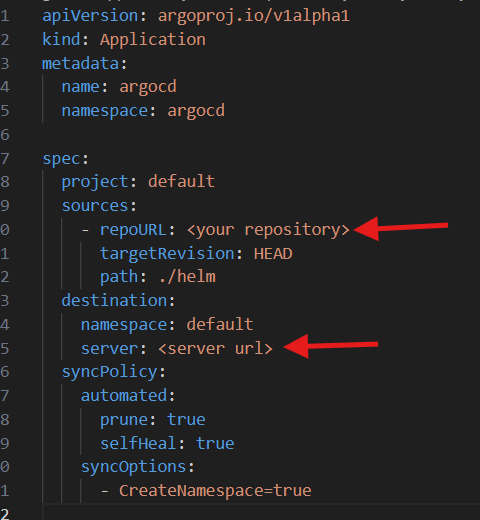

# Secure, Scalable, and Asynchronous Microservices Deployment on Azure AKS

## **Table of Contents**
- [Secure, Scalable, and Asynchronous Microservices Deployment on Azure AKS](#secure-scalable-and-asynchronous-microservices-deployment-on-azure-aks)
  - [**Table of Contents**](#table-of-contents)
  - [**Prerequisites**](#prerequisites)
  - [**Project Overview**](#project-overview)
  - [**Application Architecture**](#application-architecture)
  - [**Infrastructure Benefits**](#infrastructure-benefits)
  - [**Setting Up the Infrastructure**](#setting-up-the-infrastructure)
    - [**Terraform Configuration**](#terraform-configuration)
    - [terraform.tfvars](#terraformtfvars)
    - [Setting up the application](#setting-up-the-application)
  - [Horizontal Pod Autoscaling](#horizontal-pod-autoscaling)
  - [](#)
  - [**Automating application life-cycle with argocd (GitOps)**](#automating-application-life-cycle-with-argocd-gitops)
    - [Set up](#set-up)
- [Clean up](#clean-up)
- [Best Practices](#best-practices)

---
## **Prerequisites**
Please make sure you have installed:
- AZ CLI
- Docker CLI
- Kubernetes CLI
- Terraform
- Git
And an active azure account.

## **Project Overview**
This project demonstrates the deployment of a secure and scalable microservices architecture on Azure Kubernetes Service (AKS). It leverages best practices such as infrastructure-as-code (Terraform), container orchestration (AKS), and secure secret management with Azure Key Vault.

A key component of this architecture is Azure Service Bus, which facilitates reliable and asynchronous communication between microservices. By integrating Azure Service Bus into the application, the following benefits are achieved:

Decoupling Services: Azure Service Bus allows microservices to communicate without tightly coupling them, enabling independent scaling, updates, and maintenance.
Message Reliability: With features like message queues and topics, Service Bus ensures that messages are delivered even during transient network issues or service downtimes.
Scalability: Service Bus handles large volumes of messages and supports high-throughput scenarios, aligning with the scalability of AKS.
Enhanced Application Resilience: By using Service Bus dead-letter queues, undeliverable messages can be logged and processed later, preventing data loss and improving system reliability.
This combination of AKS and Azure Service Bus creates a robust, scalable, and resilient environment for deploying modern microservices-based applications.

---

## **Application Architecture**
The application architecture is illustrated in the following diagram:  


---

## **Infrastructure Benefits**
- **Scalability**: Leverages Kubernetes' Horizontal Pod Autoscaler to handle dynamic traffic.
- **Security**: Secure integration with Azure Key Vault for managing sensitive application secrets.
- **Automation**: Terraform automates infrastructure provisioning and ensures consistency.
- **Cost Efficiency**: Resources scale automatically based on demand, reducing over-provisioning.

---

## **Setting Up the Infrastructure**

### **Terraform Configuration**
1. **Blob Storage for Terraform State**  
   Create a Blob Storage resource to manage Terraform state:  
   ```bash
   ./tf-state-setup.sh
   ```

### terraform.tfvars
create terraform.tfvars on terraform dir.
Generate an ssh key RSA, or use an existing one and store it as "ssh_key".
Retrieve the object ID of your user AAD
```bash
az ad user list --display-name "Your Name"
```
Then store it as "object_id" in terraform.tfvars


change the relevant values on versions.tf
```bash
terraform init
```

apply the configuration 
```bash
terraform apply
```
login into the ACR and pushing the first version of the application images into ACR
```bash
./acr-init.sh
```

### Setting up the application
Establishing connection between aks to key vault with Service Connector, insert the relevant values
```bash
az aks connection create keyvault \
  --enable-csi \
  --resource-group <resource-group> \
  --name <cluster-nme> \
  --target-resource-group <key vault resource-group> \
  --vault <name of keyvault>
```

connect to aks CLI 
```bash
az aks get-credentials --resource-group <resource-group-name> --name <aks-cluster-name>
```

install the helm of secret store csi driver: https://secrets-store-csi-driver.sigs.k8s.io/getting-started/installation.html
```bash
helm repo add secrets-store-csi-driver https://kubernetes-sigs.github.io/secrets-store-csi-driver/charts
helm install csi-secrets-store secrets-store-csi-driver/secrets-store-csi-driver --namespace kube-system
```

apply provider azure installer
```bash
kubectl apply -f provider-azure-installer.yaml
```
Make sure the pods are running
```bash
kubectl get pods -l app=csi-secrets-store-provider-azure
```


Retrieve your tenant ID and keep it for next step:
```bash
az account tenant list
```

figure out what is the userAssignedIdentityID, first see which resource group has the identity
```bash
az identity list --query "[?name=='azurekeyvaultsecretsprovider-myakscluster'].{Name:name, ResourceGroup:resourceGroup}" -o table
```

then run the command to list the identity details and keep the Client ID
```bash
az identity show --name azurekeyvaultsecretsprovider-myakscluster --resource-group <CORRECT_RESOURCE_GROUP>
```

Now replace the "clientId" and "Tenantid" in secret_provider_class.yaml


Apply the secret provider class file to your cluster:
```bash
kubectl apply -f secret_provider_class.yaml
```

apply the application file
```bash
kubectl apply -f aks-store.yaml
```


## Horizontal Pod Autoscaling
In case there is high traffic that a single pod cannot handle, we can use a powerful kubernetes feature called "HorizontalPodAutoscaler", it will allow the kubernetes to know when it should increase the numbers of pods according to our configuration and conditions.
```bash
kubectl apply -f aks-store-hpa.yaml
```

---
## **Automating application life-cycle with argocd (GitOps)**
Instead of manually apply each time the k8s-config/aks-store.yaml file whenever we make new changes to the microservices images, we can automate this process using GitOps.
GitOps is a declarative approach to continuous delivery where the entire system state is version controlled in Git. The desired system state is described in repository files, and automated processes ensure the actual state matches what's defined in Git.

### Set up
Please refer to argocd installation guide [Argocd installation](./argocd/).
Now we will get a hold of the AKS server string:
```bash
kubectl config view --minify -o jsonpath='{.clusters[0].cluster.server}'
```
Replace the cluster server url in the file k8s-config/application.yaml:


After installing argocd apply application.yaml in k8s-config/application.yaml
```bash
kubectl apply -f k8s-config/application.yaml
```

# Clean up
In order to clean up our resources we can run terraform destroy command:
```bash
terraform destroy
```

Then remove the tfstate resource group
```bash
az group delete --name tfstate --yes --no-wait
```
---


# Best Practices
2 known practices are Monorepo and Polyrepo:
**Monorepo**: All microservices are in a single repository.
Pros: Easier to manage dependencies, enforce consistent tooling, easier refactoring across services.
Cons: Can become unwieldy if there are too many microservices.

**Polyrepo**: Each microservice has its own repository.
Pros: Decentralized, each service can evolve independently, better scalability in teams.
Cons: Dependency management across repos can be harder; requires tooling for integration.

Best Practice: Start with a monorepo if you have a small to medium number of services. If the number of services grows significantly, consider transitioning to a polyrepo or a hybrid approach with service-specific repos.

In my case for this project, i am using a single monorepo for the convenience of the readers. 
