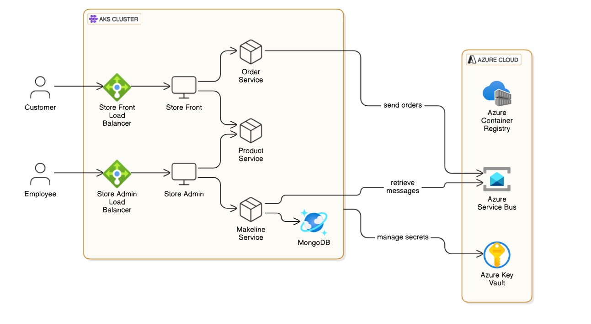
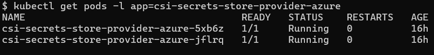
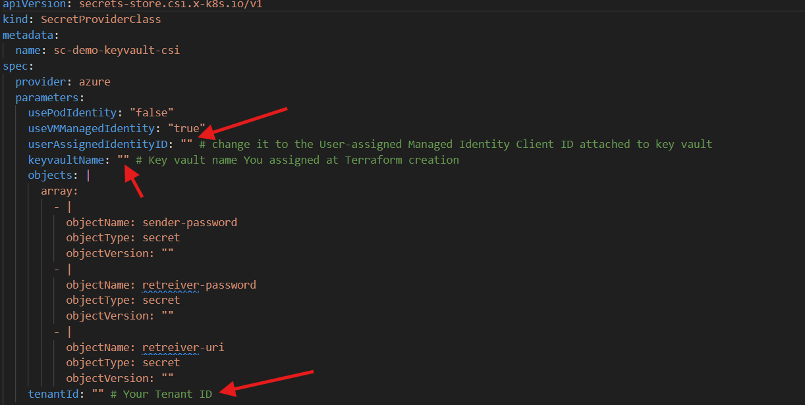
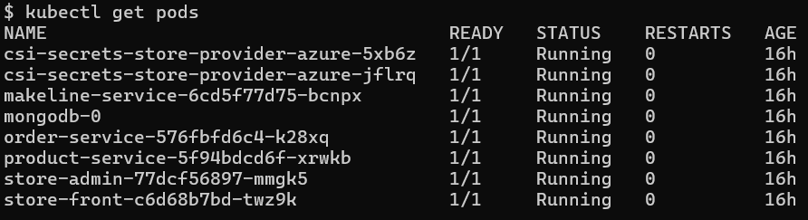
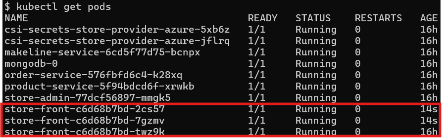

# Secure and Scalable Microservices Deployment on Azure AKS

## Table of content
....

---
### short explanation about the application
...

### Application diagram


### benefits of this infrastructure 
......


### Setting up the infrastructure
first script for creating blob storage for the tfstate
```bash
./tf-state-setup.sh
```

### terraform.tfvars
create terraform.tfvars on terraform dir.
Generate an ssh key RSA, or use an existing one and store it as "ssh_key".
Retrieve the object ID of your user AAD
```bash
az ad user list --display-name "Your Name"
```
Then store it as "object_id" in terraform.tfvars


change the relevant values on versions.tf
```bash
terraform init
```

apply the configuration 
```bash
terraform apply
```
login into the ACR and pushing the first version of the application images into ACR
```bash
./acr-init.sh
```

### Setting up the application
Establishing connection between aks to key vault with Service Connector, insert the relevant values
```bash
az aks connection create keyvault \
  --enable-csi \
  --resource-group <resource-group> \
  --name <cluster-nme> \
  --target-resource-group <key vault resource-group> \
  --vault <name of keyvault>
```

connect to aks CLI 
```bash
az aks get-credentials --resource-group <resource-group-name> --name <aks-cluster-name>
```

install the helm of secret store csi driver: https://secrets-store-csi-driver.sigs.k8s.io/getting-started/installation.html
```bash
helm repo add secrets-store-csi-driver https://kubernetes-sigs.github.io/secrets-store-csi-driver/charts
helm install csi-secrets-store secrets-store-csi-driver/secrets-store-csi-driver --namespace kube-system
```

apply provider azure installer
```bash
kubectl apply -f provider-azure-installer.yaml
```
Make sure the pods are running
```bash
kubectl get pods -l app=csi-secrets-store-provider-azure
```



Retrieve your tenant ID and keep it for next step:
```bash
az account tenant list
```

figure out what is the userAssignedIdentityID, first see which resource group has the identity
```bash
az identity list --query "[?name=='azurekeyvaultsecretsprovider-myakscluster'].{Name:name, ResourceGroup:resourceGroup}" -o table
```

then run the command to list the identity details and keep the Client ID
```bash
az identity show --name azurekeyvaultsecretsprovider-myakscluster --resource-group <CORRECT_RESOURCE_GROUP>
```

Now replace the "clientId" and "Tenantid" in secret_provider_class.yaml


Apply the secret provider class file to your cluster:
```bash
kubectl apply -f secret_provider_class.yaml
```

apply the application file
```bash
kubectl apply -f aks-store.yaml
```


## Horizontal Pod Autoscaling
In case there is high traffic that a single pod cannot handle, we can use a powerful kubernetes feature called "HorizontalPodAutoscaler", it will allow the kubernetes to know when it should increase the numbers of pods according to our configuration and conditions.
```bash
kubectl apply -f aks-store-hpa.yaml
```



# Clean up
In order to clean up our resources we can run terraform destroy command:
```bash
terraform destroy
```

Then remove the tfstate resource group
```bash
az group delete --name tfstate --yes --no-wait
```