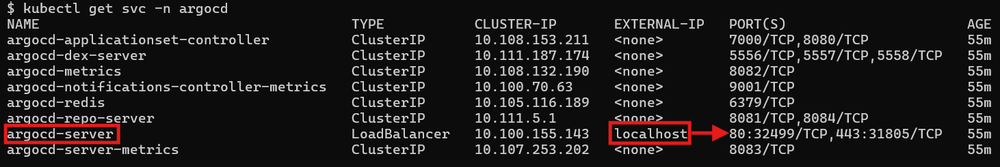
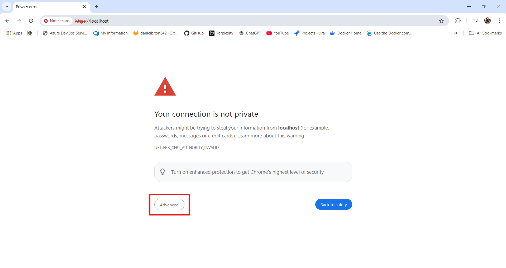
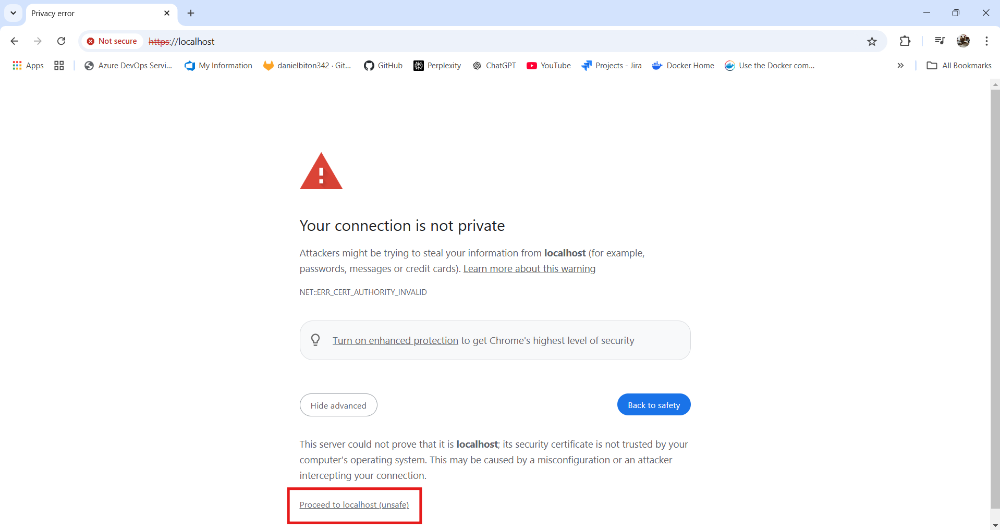
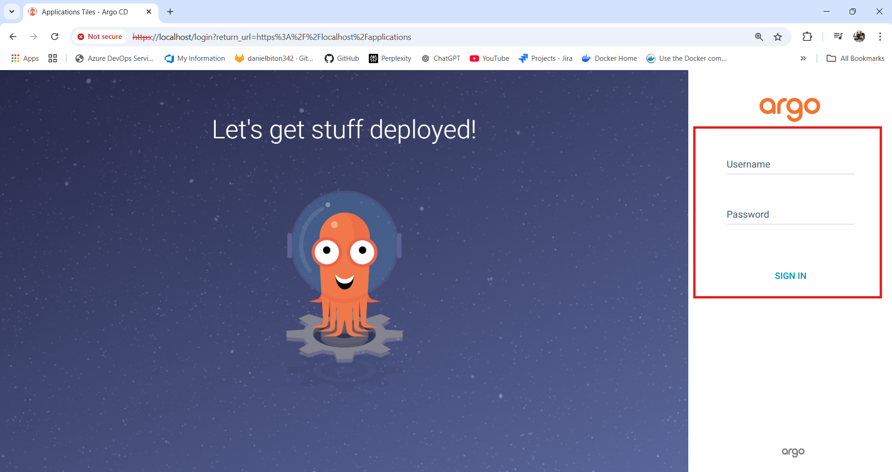
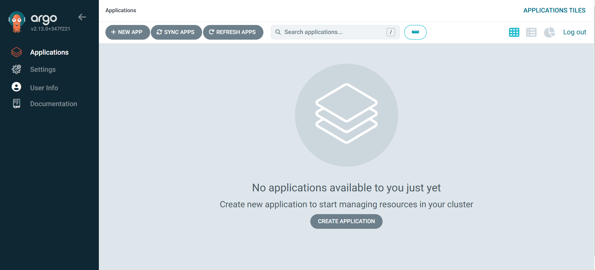
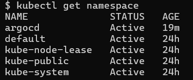
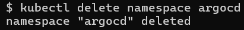

# ArgoCD Installation Guide

This guide provides step-by-step instructions for setting up ArgoCD on a Kubernetes cluster.

## Table of Contents

- [ArgoCD Installation Guide](#argocd-installation-guide)
  - [Table of Contents](#table-of-contents)
  - [Prerequisites](#prerequisites)
  - [Installation Steps](#installation-steps)
    - [1. Create ArgoCD Namespace](#1-create-argocd-namespace)
    - [2. Deploy ArgCD Components](#2-deploy-argcd-components)
    - [3. Configure External Access](#3-configure-external-access)
    - [4. Retrieve Initial Admin Password](#4-retrieve-initial-admin-password)
    - [5. Access ArgoCD UI](#5-access-argocd-ui)
    - [6. Login to ArgoCD](#6-login-to-argocd)
- [Cleanup](#cleanup)

## Prerequisites

Before you begin, ensure you have:

- `kubectl` CLI tool installed on your local machine
- Access to a Kubernetes cluster (kubeconfig file typically located at `~/.kube/config`)

## Installation Steps

### 1. Create ArgoCD Namespace

First, create a dedicated namespace for ArgoCD:

```bash
kubectl create namespace argocd
```
 ### 2. Deploy ArgCD Components
 Run the following command:
 ```bash
 kubectl apply -n argocd -f https://raw.githubusercontent.com/argoproj/argo-cd/stable/manifests/install.yaml
 ```

 ### 3. Configure External Access
 Change the argocd-server service type to LoadBalancer:
 ```bash
 kubectl patch svc argocd-server -n argocd -p '{"spec": {"type": "LoadBalancer"}}'
 ```
### 4. Retrieve Initial Admin Password
Run the following command to retrieve the password:
 ```bash
 kubectl -n argocd get secret argocd-initial-admin-secret -o jsonpath='{.data.password}' | base64 -d
 ```

 ### 5. Access ArgoCD UI
 First, run a command to see the available services:
 ```bash
 kubectl get svc -n argocd
 ```

 

 Please note that argocd is running on localhost and the port it uses, so in order to access the ArgoCD UI, go to this URL:
  ```bash
  http://localhost:80
  ```

### 6. Login to ArgoCD
You might face a privacy error because the url is using https which is a secured protocol, in this case click on advanced:



Now proceed to localhost (unsafe)



Username is admin and the password is the one we retrieved at [Retrieve Initial Admin Password](#4-retrieve-initial-admin-password)



Hooray! you now have a working ArgoCD agent on your cluster and a place to manage it.




- For further information you can check the ArgoCD documentation 
  [ArgoCD documentation](https://argo-cd.readthedocs.io/en/stable/)


# Cleanup

First let's see what is going on in our cluster
```bash
kubectl get namespace
```


In order to remove the ArgoCD agent and all it's resources we will run:
```bash
kubectl delete namespace argocd
```


```bash
helm repo remove "repo-name"
```